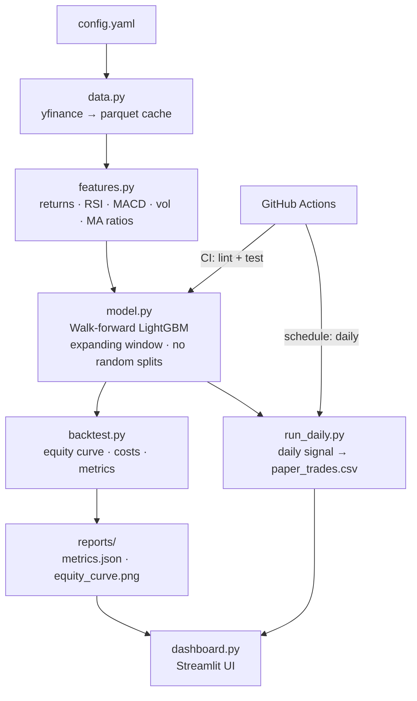
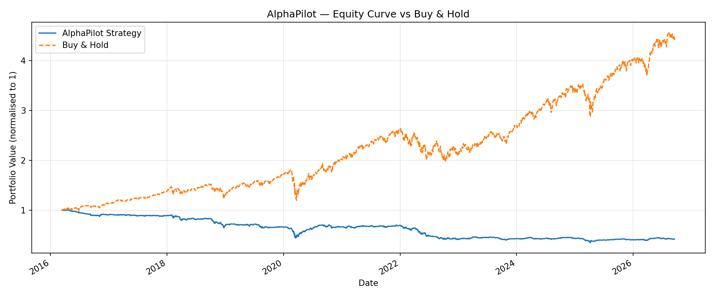

# AlphaPilot 🚀

> **Not financial advice. Paper trading only. No real money is ever used.**

An end-to-end AI trading research and paper-trading pipeline built for
reproducibility and honest evaluation — not flashy backtested returns.

---

## Problem Statement

Can a LightGBM classifier trained on technical features (returns, RSI, MACD,
volatility, volume) produce a market-timing signal that beats buy-and-hold on
SPY after realistic transaction costs?  AlphaPilot answers this question with
a fully reproducible, zero-look-ahead pipeline.

---

## Architecture



---

## How to Run

### Prerequisites
```
Python 3.11+   Docker (optional)
```

### Quick start (Windows PowerShell)
```powershell
git clone <repo>
cd alphapilot
pip install -e ".[dev]"
python train_backtest.py
python -m ruff check .
python -m pytest -q
python -m streamlit run dashboard.py
python run_daily.py
```

### Docker
```bash
docker build -t alphapilot .
docker run -p 8501:8501 alphapilot
```

### Change tickers / dates
Edit `config.yaml`:
```yaml
data:
  tickers: [SPY, AAPL, MSFT]
  start: "2015-01-01"
```

---

## Real Results (OOS period: 2016-03-15 → 2026-09-17)

Results are generated by `python train_backtest.py` then `python scripts/update_readme.py` — **not hardcoded**.

<!-- RESULTS:START -->
OOS period: **2016-03-15 → 2026-09-17** (ticker: SPY)



| Metric | Net Strategy | Gross (zero-cost) | Buy & Hold (SPY) |
|---|---|---|---|
| CAGR | **-7.87%** | +6.47% | +15.36% |
| Sharpe | -0.49 | 0.50 | 0.90 |
| Max Drawdown | -64.99% | -35.06% | -33.72% |

| Metric | Value |
|---|---|
| Win Rate | +51.42% |
| Turnover | 38.25% |
| Total Trades | 1011 |
| OOS Accuracy | 0.4974 |
| OOS AUC | 0.4869 |
| Exposure | 56.15% |
| Avg Holding Days | 2.93 |

> The net strategy **underperforms** buy-and-hold. This is the honest result.
> Transaction costs removed ~+14.34% CAGR (gross +6.47% → net -7.87%).
> OOS AUC = 0.4869 (near 0.5) — no detectable predictive edge.

### Other tickers (same model, same parameters)

| Ticker | Net CAGR | Sharpe | OOS AUC |
|---|---|---|---|
| AAPL | -2.28% | 0.00 | 0.4878 |
| MSFT | -0.96% | 0.07 | 0.5167 |
<!-- RESULTS:END -->

---

## Limitations

1. **Overfitting risk** — LightGBM can fit noise; walk-forward evaluation prevents reporting in-sample results.
2. **Survivorship bias** — only currently-traded tickers are used; delisted
   stocks are excluded.
3. **Transaction costs are approximate** — real slippage depends on order size,
   time of day, and market conditions.
4. **No regime detection** — the model treats bull and bear markets identically.
5. **Single-asset** — no portfolio diversification or position sizing.
6. **Technical features only** — no fundamentals, news, or macro data.
7. **Daily bars** — intraday dynamics are ignored.

---

## Project Structure

```
alphapilot/
├── src/alphapilot/
│   ├── config.py       # YAML loader
│   ├── data.py         # yfinance download + parquet cache
│   ├── features.py     # RSI, MACD, returns, vol, MA ratios
│   ├── model.py        # walk-forward LightGBM
│   ├── backtest.py     # equity curve + metrics
│   └── metrics.py      # CAGR, Sharpe, max drawdown
├── scripts/
│   └── update_readme.py  # regenerate README results table
├── tests/
│   ├── test_features.py
│   ├── test_no_leakage.py   # ← proves zero look-ahead bias
│   ├── test_backtest.py
│   └── test_scripts.py
├── train_backtest.py   # main pipeline entrypoint
├── run_daily.py        # daily paper-trading signal
├── dashboard.py        # Streamlit UI
├── config.yaml
├── Makefile
├── Dockerfile
├── pyproject.toml
└── .github/workflows/ci.yml
```

---

*⚠️ This project is for educational and research purposes only.
It is not financial advice and should not be used to make real investment decisions.*
